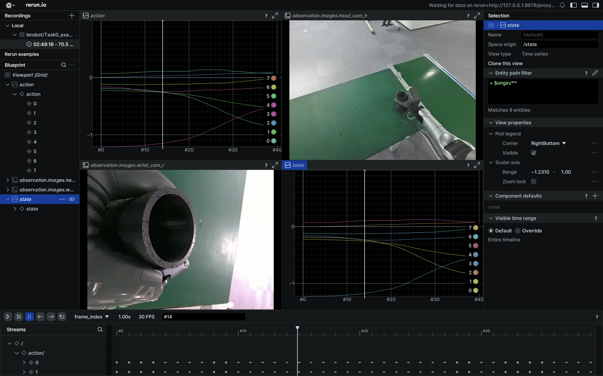

# 🔄数据转换
### [数据集格式说明](https://doc.weixin.qq.com/doc/w3_AcYAwwYeABkCNRAgoXyynTKy3zgFO?scode=ABgApAe2ABEqV1BDSxAcYAwwYeABk)

 - ⚠️⚠️⚠️ 若从数采平台直接导出lerobot格式数据包，可跳过此章节。

🤖 **Kuavo IL** 是一个完整的机器人模仿学习框架，基于 [LeRobot](https://github.com/huggingface/lerobot) 构建，专为 Kuavo 人形机器人设计。该框架提供了从数据转换、模型训练到实际部署的完整工具链。

🎯 **核心特性**：
- 🔄 **数据转换**: 支持 ROS bag 到 LeRobot 格式的转换
- 🚀 **一键训练**: 提供数据转换与模型训练的一体化解决方案
- 🎮 **实时部署**: 支持训练模型在实际机器人上的实时推理和控制
- 📊 **完整评估**: 提供离线评估和在线部署的完整验证流程

🏗️ **项目架构**：
```
kuavo-il-opensource/
├── kuavo/                    # 核心功能模块
│   ├── kuavo_1convert/       # 数据转换工具
│   ├── kuavo_2train/         # 模型训练工具
│   ├── kuavo_3deploy/        # 模型部署工具
│   └── notebooks_check/      # 数据验证与可视化
└── lerobot/                  # LeRobot 框架 
```

## 🚀 快速开始

### 训练环境安装
```bash
git clone https://gitee.com/leju-robot/kuavo-il-opensource.git
cd kuavo-il-opensource
```

2. **创建虚拟环境**
```bash
conda create -n kuavo_il python=3.10
conda activate kuavo_il
```

3. **安装依赖**
```bash
# 安装 LeRobot
pip install -e lerobot
```

## 📦 数据准备

### 目录结构

推荐的数据集目录结构如下：
```
your_task_name/
├── rosbag/          # 数采平台导出解压的bag包
└── sup_bag/         # 辅助的bag包（可选,如到达机器人起始工作位置的go_bag）
```

### 数据转换流程

Kuavo IL 支持从 ROS bag 数据快速转换为 LeRobot 格式。转换前需要先配置 `kuavo_1convert/lerobot_dataset.yaml` 文件：

### 配置文件
使用`lerobot_dataset.yaml`进行配置：

```yaml
only_arm: true  # 默认true, 是否只使用手臂数据, 目前的模仿学习只用于手臂数据
eef_type: dex_hand # or leju_claw
which_arm: both  # 可选: left, right, both

# task_description: "Pick the black workpiece from the white conveyor belt on your left and place it onto the white box in front of you"
task_description: "Place the black workpiece from the white desk onto the electronic scale, then move the it to the left white conveyor belt"

train_hz: 10  # 训练采样频率
main_timeline_fps: 30 # 主相机的帧率，必须稳定, 主相机来自head_cam_h, wrist_cam_l, wrist_cam_r
sample_drop: 10 # 丢弃回合前后的10帧

# dex_dof_needed是强脑手需要的自由度数目。强脑灵巧手有6个自由度。标准握拳状态[100] * 6, 张开状态[0] * 6。
# 1: 不需要精细操作或者多指协同操作时，通常为设置为1，表示只需要第一个关节作为开合依据,此时需要用[0, 100, 0, 0, 0, 0]表示张开状态, [100] * 6表示握拳状态。
# 2(暂未测试): 或者设置为2，目前的手柄遥操作只有两个自由度。0,2,3,4,5自由度绑定为1个自由度。
# 6(暂未测试): 如果脱离手柄使用手指灵巧操作，可以设置为6，表示需要所有6个自由度。
dex_dof_needed: 1   # default=1

is_binary: false  # 是否将开合二值化, default=false
delta_action: false # 是否使用增量动作，default=false
relative_start: false # 是否使用相对起始位置, default=false

resize:
  width: 848
  height: 480
```

#### 主要配置项说明
- `eef_type`: 末端执行器类型，可选'dex_hand'（灵巧手）或'leju_claw'（乐聚夹爪）
- `which_arm`: 使用的手臂，可选'left'（左臂）、'right'（右臂）或'both'（双臂）
- `train_hz`: 训练数据的采样频率
- `main_timeline`: 用于时间对齐的主时间线话题
- `dex_dof_needed`: 灵巧手使用的自由度数量

### 转换代码
`Zed`: 如果相机是zed相机，需要把`kuavo/kuavo_1convert/common/config_dataset.py`第51行`cameras = ['head_cam_h']`修改为`cameras = ['head_cam_l']`
```bash
# 转换 ROS bag 到 LeRobot 格式
python kuavo/kuavo_1convert/cvt_rosbag2lerobot.py --raw_dir RAW_DIR [-n NUM_OF_BAG] [-v PROCESS_VERSION]

# 例:
python kuavo/kuavo_1convert/cvt_rosbag2lerobot.py  --raw_dir kuavo/kuavo_1convert/Task0_example/rosbag -v v_example
```
必选参数:
  --raw_dir RAW_DIR    原始ROS包目录路径

可选参数:
  -n NUM_OF_BAG       要处理的包文件数量
  -v PROCESS_VERSION  处理版本（默认'v0'，'v_example'是一个示例）

**注**:转换后的lerobot数据在指定存放在装载RosBag数据集的文件夹的同级目录，本案例的转换后目录结构如下
```bash
kuavo/kuavo_1convert/Task0_example
├── rosbag
│   └── example.bag
└── v_example
    └── lerobot
        ├── data
        │   └── chunk-000
        │       └── episode_000000.parquet
        ├── meta
        │   ├── episodes.jsonl
        │   ├── info.json
        │   ├── stats.json
        │   └── tasks.jsonl
        └── videos
            └── chunk-000
                ├── observation.images.head_cam_h
                │   └── episode_000000.mp4
                └── observation.images.wrist_cam_r
                    └── episode_000000.mp4
```

转换完成后可以可视化数据集：
```bash
# 可视化转换完毕的 lerobot dataset：
python lerobot/lerobot/scripts/visualize_dataset.py --repo-id lerobot/Task0_example --root kuavo/kuavo_1convert/Task0_example/v_example/lerobot  --episode 0 --local-files-only 1
```
这是Task0_example的可视化:

以下是一个双臂操作的可视化示例:


### bag转换zarr(此案例主线未使用zarr格式，仅做演示)

1.进入仓库

```bash
cd kuavo-il-opensource
```
2.进行格式转换

```bash
python /home/lejurobot/tjy/kuavo-il-opensource/kuavo/kuavo_1convert/cvt_rosbag2zarr.py -b /home/lejurobot/mydisk/data/Task17_cup/rosbag -c /home/lejurobot/tjy/kuavo-il-opensource/kuavo/kuavo_1convert/config/Task14_cup.yaml -n 3 -a
```
**[注]**: 转换代码格式如下

```bash
Python [转换脚本]  
-b [bag数据集文件] 
-c [配置文件路径(根据bag话题修改对应的yaml文件，内包含不同话题的处理方法以及抽帧值)] 
-n [需要处理的bag包数量]
-a [如果需要合并多个任务的数据，这里可以加上-a] 
-l [图像的压缩质量，越小质量越低(0-100)]
```
